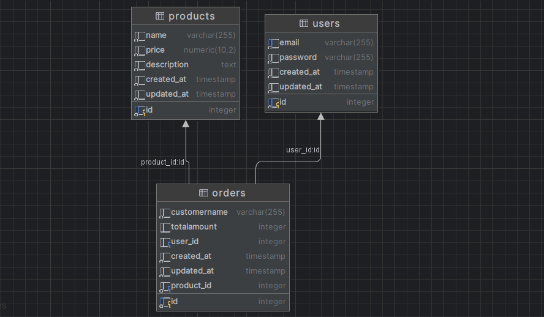

# GO E-commerce App
# Balgabek Zhaksylyk 22B030539
## Database Schema



## Getting Started

To get started with using the Social Media API, follow the steps below:

### Prerequisites

- Go programming language installed on your system.
- PostgreSQL database installed and running.

### Installation

1. Clone the repository:

   ```
   git clone <repository-url>
   ```

2. Install dependencies:

   ```
   go mod tidy
   ```

3. Build the project:

   ```
   go build
   ```

### Configuration

The API can be configured using environment variables or command-line flags. Available configurations are:

- `PORT`: Port on which the server will listen. Default is `8081`.
- `ENV`: Environment mode (`development`, `staging`, or `production`). Default is `development`.
- `DB_DSN`: PostgreSQL database connection string.

### Running the Server

Run the server using the following command:

```
go run .
```

## API Endpoints

The following endpoints are available in the API:

### Users

- `GET /api/v1/users`: Get all users.
- `GET /api/v1/users/{userId}`: Get a user by ID.
- `PUT /api/v1/users/{userId}`: Update a user by ID.
- `DELETE /api/v1/users/{userId}`: Delete a user by ID.

### Products

- `POST /api/v1/products`: Create a new product.
- `GET /api/v1/products/{productID}`: Get a product by ID.
- `PUT /api/v1/products/{productID}`: Update a product by ID.
- `DELETE /api/v1/products/{productID}`: Delete a product by ID.

### Comments

- `POST /api/v1/orders`: Create a new order.
- `GET /api/v1/orders/{orderId}`: Get a order by ID.
- `PUT /api/v1/orders/{ordersId}`: Update a order by ID.
- `DELETE /api/v1/order/{orderId}`: Delete a order by ID.


